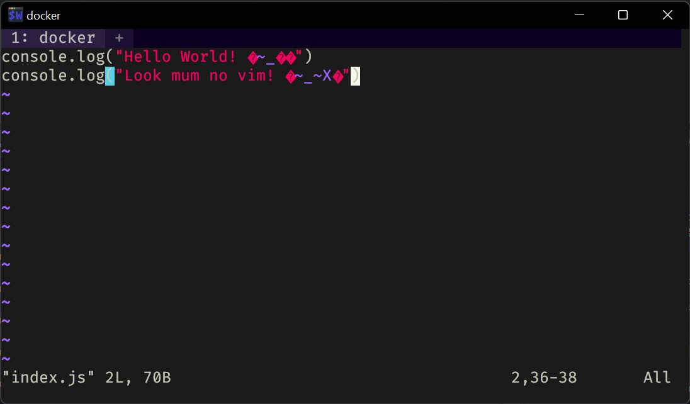
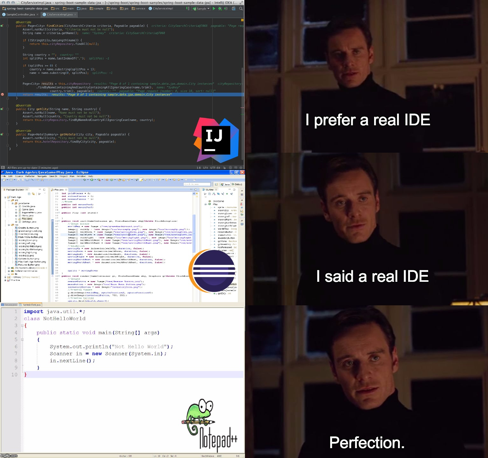
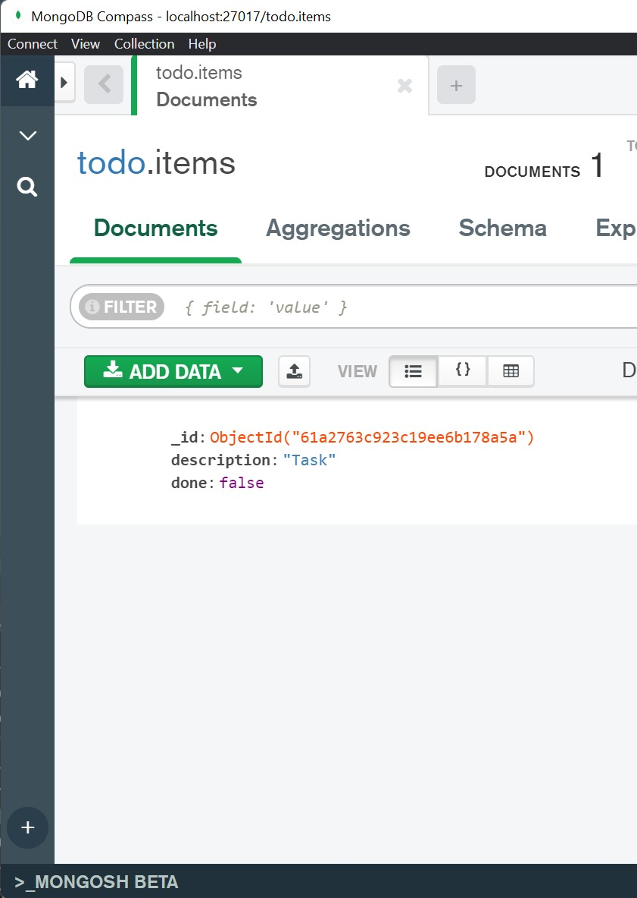
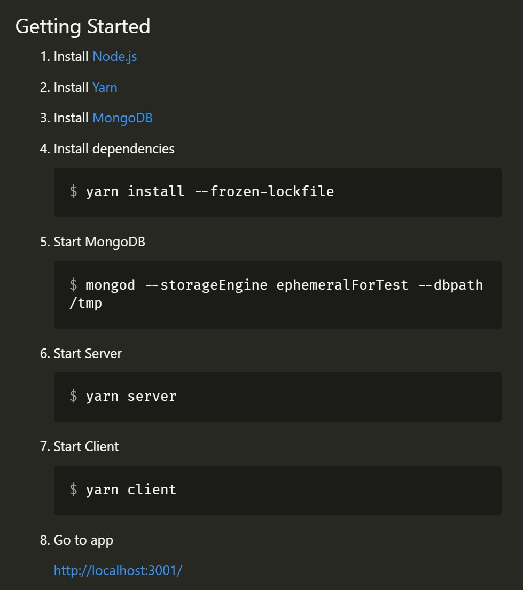

<!--

Welcome to my presentation on 'Docker for development'

-->

# <!-- fit --> Docker for development<br>:whale: :electric_plug: :technologist:

<style scoped>
section {
    text-align: center;
}
</style>

---

<!--

But first.

Let's cover why you might want to use Docker for your development environment.

Recently I went to a conference in Seattle and a I met a bunch of interesting people.

One person I met had developed a "cross platform" 2D game library, with basic examples and everything.

While at the airport I had a spare moment so I thought I'll download it, build it and run one of the examples.

So this is his documentation which I followed.

-->


<section style="overflow-y: scroll">
    
</section>

---

<!--

Once I had all the dependencies installed.

I ran the build script, and it compiled successfully (ignoring a few compiler warnings).

When it comes to running an example, you'll see it fails with a relatively informative error about failing to create a window.

So this is not a great experience as a developer.

Especially once who has not experience of the project.

I know a bit of C/C++ and maybe a bit of CMake, but do I know enough about GLFW to immediately know how to to fix this issue?

No!

-->

<script id="asciicast-TGCwEdSUM2tFdsuR6RW9S99O7" src="https://asciinema.org/a/TGCwEdSUM2tFdsuR6RW9S99O7.js" data-size="big" async></script>

<style scoped>
section {
    text-align: center;
}
</style>

---

<!--

Looking at this you might be thinking.

Well serves you right for using C.

This is why interpretted languages and JIT compilers exist.

So I can write once and run everywhere.

-->

# Lies!

```bash
joshua@diplodocus:~$ which node
/home/joshua/.nvm/versions/node/v16.13.0/bin/node

joshua@diplodocus:~$ ldd /home/joshua/.nvm/versions/node/v16.13.0/bin/node
        linux-vdso.so.1 (0x00007ffc5b77a000)
        libdl.so.2 => /lib/x86_64-linux-gnu/libdl.so.2 (0x00007fc070dc8000)
        libstdc++.so.6 => /lib/x86_64-linux-gnu/libstdc++.so.6 (0x00007fc070be7000)
        libm.so.6 => /lib/x86_64-linux-gnu/libm.so.6 (0x00007fc070a98000)
        libgcc_s.so.1 => /lib/x86_64-linux-gnu/libgcc_s.so.1 (0x00007fc070a7d000)
        libpthread.so.0 => /lib/x86_64-linux-gnu/libpthread.so.0 (0x00007fc070a5a000)
        libc.so.6 => /lib/x86_64-linux-gnu/libc.so.6 (0x00007fc070868000)
        /lib64/ld-linux-x86-64.so.2 (0x00007fc070de1000)
```

---


<style scoped>
section {
    text-align: center;
}
img {
    width: 100%;
}
</style>

---

<!--

So given most things have some dependency or another on the operating system.

How do we solve this issue in a way where we do not have to worry about the environment we are running in.

-->

# Winblows?

```powershell
C:\Users\Joshua>dumpbin /nologo /dependents "C:\Program Files\nodejs\node.exe"

Dump of file C:\Program Files\nodejs\node.exe

File Type: EXECUTABLE IMAGE

  Image has the following dependencies:

    dbghelp.dll
    WS2_32.dll
    IPHLPAPI.DLL
    PSAPI.DLL
    USERENV.dll
    ADVAPI32.dll
    USER32.dll
    CRYPT32.dll
    bcrypt.dll
    KERNEL32.dll
    WINMM.dll
```

---


# The promise of Docker

* Consistent _**runtime**_ environment
* Tools for developers
    * Docker Desktop
* Interoperable format (Docker Image)
* Self documenting (`Dockerfile`)
* Easy* to use APIs (CLI, HTTP API)
* Widely adopted
    * Kubernetes
    * GitHub Actions
    * EKS, AKS, GKE

<footer>
* Your mileage may vary
</footer>

---

# :stars: Humble beginnings

```bash
$ node --version # Node.js running on my host
v16.13.0

$ docker run --rm node --version # Node.js running in a container
v17.1.0

$ docker run --rm node:latest --version # <image>:<tag> the default tag is 'latest'
v17.1.0

$ docker run --rm node:16.13.0 --version # Specific Node.js running inside a container
v16.13.0

$ docker run --rm node which node # Location of Node.js binary inside the container
/usr/local/bin/node

$ docker run --rm node ldd /usr/local/bin/node # Dependencies of Node.js inside the container
        linux-vdso.so.1 (0x00007ffe80b9c000)
        libdl.so.2 => /lib/x86_64-linux-gnu/libdl.so.2 (0x00007f32df703000)
        libstdc++.so.6 => /usr/lib/x86_64-linux-gnu/libstdc++.so.6 (0x00007f32df536000)
        libm.so.6 => /lib/x86_64-linux-gnu/libm.so.6 (0x00007f32df3f2000)
        libgcc_s.so.1 => /lib/x86_64-linux-gnu/libgcc_s.so.1 (0x00007f32df3d8000)
        libpthread.so.0 => /lib/x86_64-linux-gnu/libpthread.so.0 (0x00007f32df3b6000)
        libc.so.6 => /lib/x86_64-linux-gnu/libc.so.6 (0x00007f32df1f1000)
        /lib64/ld-linux-x86-64.so.2 (0x00007f32df713000
```

---

# :rocket: Blast off!

```bash
$ docker run \    # Run a command in a new container
--rm \            # Automatically remove the container when it exits
--interactive \   # Keep STDIN open even if not attached *
--tty \           # Allocate a pseudo-TTY *
--workdir ~ \     # Working directory inside the container
--name dev \      # Assign a name to the container
node \            # Official Node Docker Image
bash              # Command

# Weird no files? 😕
root@f6513673f9f6:/home/joshua# ls -lah
total 8.0K
drwxr-xr-x 2 root root 4.0K Nov 25 18:10 .
drwxr-xr-x 1 root root 4.0K Nov 25 18:10 ..

# No vim either...
root@f6513673f9f6:/home/joshua# vim
bash: vim: command not found
```

---

# :muscle: Power through

```bash
root@f6513673f9f6:/home/joshua# mkdir todo
root@f6513673f9f6:/home/joshua# cd todo/

# Initialize a Node.js module
root@f6513673f9f6:/home/joshua/todo# yarn init --yes

# Write some code
root@f6513673f9f6:/home/joshua/todo# echo "console.log('Hello World! 🥳');" > index.js

# Write some MORE code!
root@f6513673f9f6:/home/joshua/todo# echo "console.log('Look mum no vim! 😯');" >> index.js

# Run the program
root@f6513673f9f6:/home/joshua/todo# node .
Hello World! 🥳
Look mum no vim! 😯
```

---

# :house_with_garden: Feels like home?

```bash
# echo is great but and the very least give me vim
root@f6513673f9f6:/home/joshua/todo# apt update
root@f6513673f9f6:/home/joshua/todo# apt install vim
root@f6513673f9f6:/home/joshua/todo# vim index.js
```



<style scoped>
p {
    text-align: center;
}
p > img {
    width: 50%;
}
</style>

---



<style scoped>
img {
    width: 70%;
}
p {
    text-align: center;
}
</style>

---

# :confounded: Happy now?

```bash
root@f6513673f9f6:/home/joshua/todo#

# Ctrl-p, Ctrl-q => Detach from container

$ docker ps
CONTAINER ID   IMAGE     COMMAND                  CREATED          STATUS          PORTS     NAMES
f6513673f9f6   node      "docker-entrypoint.s…"   13 minutes ago   Up 13 minutes             dev

# Copying files out of the container
$ docker cp dev:/home/joshua/todo .

$ tree
.
└── todo
    ├── index.js
    └── package.json

1 directory, 2 files

# The real work begins! (launches Visual Studio Code)
$ code todo
```

---

# :hourglass_flowing_sand: A few moments layer...

```bash
$ tree .
.
└── todo
    ├── package.json
    └── src
        └── main.js

2 directories, 2 files

$ cat todo/src/main.js
console.log('I hate index.js files 😡');

$ cat todo/package.json
{
  "name": "todo",
  "version": "1.0.0",
  "main": "src/main.js",
  "license": "MIT",
  "scripts": {
    "start": "node ."
  }
}

# Copying files to the container
$ docker cp ./todo dev:/home/joshua
```

---

# :wave: See you on the other side

```bash
$ docker attach dev

root@f6513673f9f6:/home/joshua/todo# ls -lah
total 20K
drwxr-xr-x 3 node node 4.0K Nov 25 19:09 .
drwxr-xr-x 3 root root 4.0K Nov 25 18:31 ..
-rw-r--r-- 1 node node  106 Nov 25 18:50 index.js # 😢 Why are you still here?
-rw-r--r-- 1 node node   96 Nov 25 19:06 package.json
drwxr-xr-x 2 node node 4.0K Nov 25 19:07 src

root@f6513673f9f6:/home/joshua/todo# rm index.js

root@f6513673f9f6:/home/joshua/todo# node .
I hate index.js files 😡

# I don't want to maintain and sync two copies of my code
# There must be a better way...
```

---

# :rescue_worker_helmet: Bind mount to the rescue!

```bash
$ pwd
/home/joshua/projects/joshua-barnett/docker-for-development/todo

$ docker run --rm --interactive --tty --workdir /srv/todo --name dev \
# ⭐ New mount argument
--mount type=bind,source=`pwd`,target=/srv/todo \
# 📝 Less verbose
# --volume `pwd`:/srv/todo
node \
bash

root@c9d70c16b644:/srv/todo# ls
package.json  src
```

- Only difference between them is `--mount` will throw an error if the host directory does not exist.
- Whereas `--volume` will stub a missing host directory for you.

---

# :smiling_imp: The devil is in the implementation

```bash
# 🍏 Outside the container + inside bind mount (Fast! 🐇)
$ wget -q --show-progress \
https://releases.ubuntu.com/20.04.3/ubuntu-20.04.3-desktop-amd64.iso
ubuntu-20.04.3-desktop   5%[=>          ] 157.30M  44.7MB/s    eta 64s

# 🍏 Inside the container + inside bind mount (Slow! 🐌)
root@c9d70c16b644:/srv/todo# wget -q --show-progress \
https://releases.ubuntu.com/20.04.3/ubuntu-20.04.3-desktop-amd64.iso
ubuntu-20.04.3-desktop   5%[=>          ] 150.88M  5.11MB/s    eta 9m 12s

# 🍏 Inside the container + outside bind mount (Fast-ish! 🐇)
root@c9d70c16b644:/tmp# wget -q --show-progress \
https://releases.ubuntu.com/20.04.3/ubuntu-20.04.3-desktop-amd64.iso
ubuntu-20.04.3-desktop   5%[>           ] 161.04M  40.6MB/s    eta 69s
```

---
# :seedling: Grass is greener?

```bash
# 🐧 Outside the container + inside bind mount (Fast! 🐇)
$ wget -q --show-progress \
https://releases.ubuntu.com/20.04.3/ubuntu-20.04.3-desktop-amd64.iso
ubuntu-20.04.3-desktop   5%[=>          ] 159.04M  45.1MB/s    eta 63s

# 🐧 Inside the container + inside bind mount (Fast! 🐇)
root@9e3d5e4532e2:/srv/todo# wget -q --show-progress \
https://releases.ubuntu.com/20.04.3/ubuntu-20.04.3-desktop-amd64.iso
ubuntu-20.04.3-desktop   5%[=>          ] 160.96M  43.0MB/s    eta 67s

# 🐧 Inside the container + outside bind mount (Fast! 🐇)
root@9e3d5e4532e2:/tmp# wget -q --show-progress \
https://releases.ubuntu.com/20.04.3/ubuntu-20.04.3-desktop-amd64.iso
ubuntu-20.04.3-desktop   5%[=>          ] 160.21M  45.4MB/s    eta 63s
```

---

<!--
I was going to go into more detail here about how you can access the Docker VM directly.

Explain a bit about how OverlayFS works, and other parts of how it is implemented on different platforms.

However, I don't think I've got enough time for that.

So I'll wave it away as magic for now.

But here's an article explaining a bit more about how it works.

Turns out sync file systems isn't just about moving and syncing files.

If you want things like hot reload to work you will also need to propagate and communicate file events between systems, so it gets quite complicated.

All your really need to know is bind mounts are great!

But you should pick when to use them wisely because they don't work great on all platforms and can be very slow in certain use cases.

Namely...

- Installation of node_modules
- Working directories for things like databases
-->

<iframe src="https://www.docker.com/blog/deep-dive-into-new-docker-desktop-filesharing-implementation/" alt="Deep Dive Into the New Docker Desktop filesharing Implementation Using FUSE"></iframe>

<!-- ```bash
$ docker inspect dev | jq '.[].GraphDriver.Data.MergedDir'
"/var/lib/docker/overlay2/100be0d438a58870743f604ae5fbe49f46a2b3d1a0cc02a7809171396fff1b10/merged"

# Enter Docker VM on macOS
$ nc -U ~/Library/Containers/com.docker.docker/Data/debug-shell.sock

# Inside Docker VM
$ cd /var/lib/docker/overlay2/100be0d438a58870743f604ae5fbe49f46a2b3d1a0cc02a7809171396fff1b10/merged
``` -->


<style scoped>
    section {
        padding: 0;
    }
    iframe {
        height: 100%;
    }
</style>

---

# :hole: It gets worse!

<!--
This problem with the bind mount implementation is exacerbated in I/O heavy use cases.

Such as database data directories and node_modules installation.
-->

```shell
# 🍏 Outside the container + inside bind mount (Fast! 🐇)
$ time yarn install --frozen-lockfile 
# -- snip ---
✨  Done in 50.21s.
4.85s user
23.67s system
96% cpu
50.398 total

# 🍏 Inside the container + inside bind mount (8x Slower! 🐌)
root@6001c575a574:/srv/awesome-todo# time yarn install --frozen-lockfile
# -- snip --
Done in 402.74s.

real    6m43.053s
user    1m15.429s
sys     1m10.757s

# Size on disk
root@6001c575a574:/srv/awesome-todo# du -sh node_modules packages/*/node_modules
370M    node_modules
0       packages/client/node_modules
0       packages/server/node_modules
```

---

# :thinking: How to handle `node_modules`?

* Use 🐧 Linux (VM etc.) for development
    * Not very inclusive 🤨
* Install `node_modules` outside of the bind mount directory
    * ❌ Makes `node_modules` inaccessible from the host
        * ✅ But they are visible through debuggers
    * Parent directory inside the container
        * `yarn install --frozen-lockfile --modules-folder ../node_modules`
        * ❌ Doesn't work if dependencies expecting to be in the project root (hardcoded)
    * Symlink to path outside of project directory
        * `node_modules -> /tmp/node_modules`
        * ⚠️ May still not work in some cases
    * Use a persistent Docker volume
        * If you want to use cached `node_modules` from an existing Docker image
        * ⚠️ Managing the volume becomes complicated

<style scoped>
    ul {
        font-size: .9em;
    }
</style>

---

# :books: Docker volumes

* ✅ No speed penalty like _**bind mounts**_
* ✅ Use cases
    * Backing up, restoring, migrating data
    * Intermediate file storage
    * Native file system behaviour
    * High performance I/O
        * e.g. Database directories
* ⚠️ Data not easily accessible from host
    * `docker cp` if necessary
* 📄 [Manage data in Docker](https://docs.docker.com/storage/)

---

# :open_book: Example use of a Docker volume

```bash
# Start a MongoDB container running in the background
$ docker run \
--rm \     # Automatically remove the container when it exits
--detach \ # Run container in background and print container ID
--volume my_db_data_volume:/data/db \
# Create a named volume called 'my_db_data_volume'
# Mount the named volume to the path '/data/db' in the container
--name my_db \ # Assign a name to the container
mongo # Use the latest official MongoDB image

# Show running containers
$ docker ps
CONTAINER ID   IMAGE     COMMAND                  CREATED          STATUS          PORTS       NAMES
a277c6f52683   mongo     "docker-entrypoint.s…"   3 minutes ago    Up 3 minutes    27017/tcp   my_db

# Execute a mongo shell (alongside the already running mongod)
$ docker exec --interactive --tty my_db mongo

> use todo
switched to db todo

> db.items.insert({"description": "Task", "done": false})
WriteResult({ "nInserted" : 1 })

> exit

$ docker rm --force my_db
my_db
```

---

```bash
# No containers running at the moment
$ docker ps --all
CONTAINER ID   IMAGE     COMMAND   CREATED   STATUS    PORTS     NAMES

# But our MongoDB data volume still exists
$ docker volume ls
DRIVER    VOLUME NAME
local     my_db_data_volume

# Start the container again with the same arguments
$ docker run \
--rm \
--detach \
--volume my_db_data_volume:/data/db \
--name my_db \
# This time lets also publish the MongoDB port to our host
--publish 27017:27017 \
mongo

# Query MongoDB via the shell for existing items
$ docker exec my_db \
mongo todo --quiet --eval 'db.items.find().forEach(printjson)'
{
        "_id" : ObjectId("61a27159b08ff2c5624a9bba"),
        "description" : "Task",
        "done" : false
}

# Can also use a GUI on our host 👉
```



---

# :spider_web: Docker networks

- Every container is assigned to the default `bridge` network.


    ```bash
    $ docker network ls
    NETWORK ID     NAME      DRIVER    SCOPE
    f56f0ebff9c0   bridge    bridge    local
    3aaf4000c115   host      host      local
    861adb658ac5   none      null      local
    ```

---

```json
$ docker inspect my_db | jq '.[].NetworkSettings.Networks'
{
    "bridge": {
        "IPAMConfig": null,
        "Links": null,
        "Aliases": null,
        "NetworkID": "f56f0ebff9c02f8c81a2cb4983740d70eae5f79968c49f282d3641a9fdea353e",
        "EndpointID": "4111d8d341b634e8851d5a37fe06773e37930e7d5dcd9d5ab1f075803f0e6838",
        "Gateway": "172.17.0.1",
        "IPAddress": "172.17.0.2",
        "IPPrefixLen": 16,
        "IPv6Gateway": "",
        "GlobalIPv6Address": "",
        "GlobalIPv6PrefixLen": 0,
        "MacAddress": "02:42:ac:11:00:02",
        "DriverOpts": null
    }
}
```

---

# :thumbsdown: Don't do this at home

```bash
# Creating a new 'client' container that will connect to 'my_db' through bridge
$ docker run --rm --name my_client --interactive --tty mongo bash

# Can't connect to 'my_db' container through 'localhost'.
root@63dcb850b14f:/# mongo todo --quiet --eval 'db.items.find().forEach(printjson)'
Error: could not connect to server 127.0.0.1:27017, connection attempt failed: SocketException:
Error connecting to 127.0.0.1:27017 :: caused by :: Connection refused :
connect@src/mongo/shell/mongo.js:372:17
@(connect):3:6
exception: connect failed
exiting with code 1

# ❌ Requires hardcoded IP address
root@63dcb850b14f:/# mongo mongodb://172.17.0.2:27017/todo --quiet --eval 'db.items.find().forEach(printjson)'
{
        "_id" : ObjectId("61a2763c923c19ee6b178a5a"),
        "description" : "Task",
        "done" : false
}
```

---

# :thumbsup: Recommended way

* Use `--network <name>` to create a user defined bridge network.
* User-defined bridges provide automatic DNS resolution between containers.
* User-defined bridges provide better isolation.
* Containers can be attached and detached from user-defined networks on the fly.


---

# :bridge_at_night: Building bridges

```shell
# Create a user defined bridge network
$ docker network create my_network
ec58fc0d1375c280e609adc5086fd67697f55a8a3bfbde69eaaff65d9035a1ad

$ docker network ls
docker network ls
NETWORK ID     NAME         DRIVER    SCOPE
f56f0ebff9c0   bridge       bridge    local
3aaf4000c115   host         host      local
ec58fc0d1375   my_network   bridge    local 😊
861adb658ac5   none         null      local

# Recreate database container with '--network'
docker run --rm --detach --volume my_db_data_volume:/data/db --name my_db --publish 27017:27017 \
--network my_network \ # ⭐ New
mongo

# Recreate client container with '--network'
docker run --rm --name my_client --interactive --tty \
--network my_network \ # ⭐ New
mongo \
bash
```

---

# :relieved: Much better

```
# Install dig for DNS querying
root@924e075a1b8c:/# apt update && apt install --yes dnsutils

# Query database container name 'my_db'
root@924e075a1b8c:/# dig +short my_db
172.19.0.2

# ✅ Connecting to database using hostname
root@63dcb850b14f:/# mongo mongodb://my_db:27017/todo --quiet --eval 'db.items.find().forEach(printjson)'
{
        "_id" : ObjectId("61a2763c923c19ee6b178a5a"),
        "description" : "Task",
        "done" : false
}
```

---

# :beach_umbrella: Example project `awesome-todo`

* Database
    * `mongod` - NoSQL database

* Backend application
    * `fastify` - Web framework
    * `mongoose` - Data models
    * `graphql` - API Schema
    * `mercurius` - GraphQL API

* Frontend application
    * `create-react-app` - Frontend boilerplate
    * `styled-components` - Minor styling tweaks
    * `@apollo/client` - GraphQL client

<style scoped>
    ul {
        font-size: 0.9em;
    }
</style>

---

# :page_facing_up: RTFM

* Vague... :weary:
    * Which version of Node.js? 
    * Which version of Yarn?
    * Which version of MongoDB?
* Not very future proof :warning:
    * Will these steps still work
    5+ years from now?
* What if port `3001` is taken?
    * How do I change it?
* Cross platform?
    * ...works on my machine :shrug:
    * :angry:



---

# :trident: Dockerizing `awesome-todo`

<!--
Now we could put this command in our readme in addition to the previous commands.

However, it would probably be a better user experience to put it in a shell script.
-->

*   Starting our development container.

    ```bash
    $ docker run \
    --interactive \
    --tty \
    # Working directory
    --workdir /srv/awesome-todo \
    # Bind mount source into container
    --volume `pwd`:/srv/awesome-todo \
    # Latest Node.js LTS (at the moment)
    node:16.13.0 \
    bash
    ```

---

# :penguin: Linux permissions (Gotcha)

```bash
# 📦 Default user?
root@6de80090a66a:/srv/awesome-todo# whoami
root

# 📦 GID and UID of root are '0'
root@6de80090a66a:/srv/awesome-todo# cat /etc/passwd | grep root
root:x:0:0:root:/root:/bin/bash

# 📦 Creating a empty file
root@6de80090a66a:/srv/awesome-todo# touch cant-touch-this

# 📦 File is owned by root inside container
root@6de80090a66a:/srv/awesome-todo# ls -lah cant-touch-this
-rw-r--r-- 1 root root 0 Nov 28 18:43 cant-touch-this
```

---

```bash
# 🖥️ Permissions on host
$ ls -lh
total 604K
-rw-r--r-- 1 root   root      0 Nov 28 18:45 cant-touch-this
-rw-r--r-- 1 joshua joshua  468 Nov 28 18:13 package.json
drwxr-xr-x 5 joshua joshua 4.0K Nov 28 17:55 packages
-rw-r--r-- 1 joshua joshua 1.3K Nov 27 16:44 README.md
-rw-r--r-- 1 joshua joshua 589K Nov 28 18:23 yarn.lock

# 🖥️ GID and UID of root
$ cat /etc/passwd | grep root
root:x:0:0:root:/root:/bin/bash

# 🖥️ GID and UID of my user
$ cat /etc/passwd | grep joshua
joshua:x:1000:1000:,,,:/home/joshua:/usr/bin/zsh

# 📦 Which user is 1000 inside the container?
root@6de80090a66a:/srv/awesome-todo# cat /etc/passwd | grep 1000
node:x:1000:1000::/home/node:/bin/bash
```

---

# :memo: Amendment `--user`

```bash
# 🖥️ Creating development shell on host
$ docker run \
--rm \
--interactive \
--tty \
--workdir /srv/awesome-todo \
--volume `pwd`:/srv/awesome-todo \
# ⭐ Specifying node as the user we want to start with
--user node \
node:16.13.0 \
bash

# 📦 Creating empty file
node@b48146bd2871:/srv/awesome-todo$ touch can-touch-this

# 📦 File owned by node inside container
node@b48146bd2871:/srv/awesome-todo$ ls -lh can-touch-this
-rw-r--r-- 1 node node 0 Nov 28 18:54 can-touch-this

# 🖥️ File owned by me outside container
$ ls -lh can-touch-this
-rw-r--r-- 1 joshua joshua 0 Nov 28 18:54 can-touch-this
```

---

# :inbox_tray: Installing `node_modules`

```bash
# 📦 Set the modules folder location outside of bind mount
node@b48146bd2871:/srv/awesome-todo$ echo '--modules-folder /tmp/awesome-todo/node_modules' > .yarnrc

# 📦 Try starting the server as a test
node@b48146bd2871:/srv/awesome-todo$ yarn server
yarn run v1.22.15
$ yarn workspace @awesome-todo/server start
$ fastify start -d -w -l info -P src/app.mjs
/bin/sh: 1: fastify: not found # 😵 What went wrong?

# 📦 Printing ${PATH} to debug
node@b48146bd2871:/srv/awesome-todo$ yarn server
yarn run v1.22.15
$ yarn workspace @awesome-todo/server start
$ echo ${PATH} | sed s/:/\\n/g | grep awesome-todo
/srv/awesome-todo/packages/server/tmp/awesome-todo/node_modules/.bin
/home/node/.config/yarn/link/tmp/awesome-todo/node_modules/.bin
/srv/awesome-todo/tmp/awesome-todo/node_modules/.bin
/srv/awesome-todo/tmp/awesome-todo/node_modules/.bin
/home/node/.config/yarn/link/tmp/awesome-todo/node_modules/.bin
/srv/awesome-todo/tmp/awesome-todo/node_modules/.bin
Done in 0.52s.

# 📦 Bug in yarn? 🤷
```

---

```bash
# 📦 Updating PATH to be correct
node@b48146bd2871:/srv/awesome-todo$ export PATH="${PATH}:/tmp/awesome-todo/node_modules/.bin"

# 📦 Node.js cannot resolve the node_modules because they are not in the parent
node@b48146bd2871:/srv/awesome-todo$ yarn server
yarn run v1.22.15
$ yarn workspace @awesome-todo/server start
$ fastify start -d -w -l info -P src/app.mjs
Error [ERR_MODULE_NOT_FOUND]: Cannot find package 'config' imported from /srv/awesome-todo/packages/server/src/app.mjs
# -- snip --

# Symlinking /tmp/awesome-todo/node_modules into the parent
node@b48146bd2871:/srv/awesome-todo$ ln -s /tmp/awesome-todo/node_modules

# Third times the charm
node@b48146bd2871:/srv/awesome-todo$ yarn server
yarn run v1.22.15
$ yarn workspace @awesome-todo/server start
$ fastify start -d -w -l info -P src/app.mjs
Debugger listening on ws://0.0.0.0:9320/3867d4ef-3eb9-4f38-a781-e8f6eee92592
For help, see: https://nodejs.org/en/docs/inspector

# Good stuff 👍
```

---

# :heavy_plus_sign: Adding new dependencies


```bash
# 📦 Adding prettier for formatting server code
node@b48146bd2871:/srv/awesome-todo$ yarn workspace @awesome-todo/server add --dev prettier
# -- snip --
success Saved lockfile.
success Saved 1 new dependency.
info Direct dependencies
info All dependencies
└─ prettier@2.5.0
Done in 8.43s.
Done in 8.72s.

# 📦 Adding lint script to server package
node@b48146bd2871:/srv/awesome-todo$ cat packages/server/package.json | grep lint
    "lint": "prettier --check config src test",

# 📦 Running lint script
node@b48146bd2871:/srv/awesome-todo$ yarn workspace @awesome-todo/server lint
yarn workspace v1.22.15
yarn run v1.22.15
$ prettier --check config src test
Checking formatting...
All matched files use Prettier code style!
Done in 1.03s.
Done in 1.33s.
```

---

# `Dockerfile`

* We have made changes the development environment we want to share
    * Installed dependencies `/tmp/awesome-todo/node_modules`
    * Changed the `PATH` variable
* Lets document and automate these changes by providing a `Dockerfile`

---

```dockerfile
# ⚠ Cannot use sha256 if you want to support multi-arch 😔
ARG NODE_VERSION="16.13.0"

FROM node:${NODE_VERSION} AS base

FROM base AS install

ARG PROJECT="awesome-todo"

WORKDIR /srv/${PROJECT}

# If these files change...
COPY package.json yarn.lock .yarnrc ./
COPY packages/server/package.json packages/server/
COPY packages/client/package.json packages/client/
COPY packages/shared/package.json packages/shared/

# ...this will run again when rebuilt
RUN yarn install --frozen-lockfile

FROM base AS dev

ARG PROJECT="awesome-todo"

# Copy just what we want from the previous stage
COPY --from=install /tmp/${PROJECT}/node_modules /tmp/${PROJECT}/node_modules

# Updating PATH variable
ENV PATH="${PATH}:/tmp/${PROJECT}/node_modules/.bin"
```

---

# :monkey: That is one chunky monkey

```bash
# 🔨 Enabling buildkit
$ export DOCKER_BUILDKIT=1

$ docker build --tag awesome-todo/dev --target node_modules .
# -- snip --
Successfully built afdf832b7e20
Successfully tagged awesome-todo/dev:latest

# Eye-wateringly large image of 1.17GB! 😭 
$ docker image ls awesome-todo/dev
REPOSITORY         TAG       IMAGE ID       CREATED         SIZE
awesome-todo/dev   latest    5c404aa9d660   4 minutes ago   1.17GB

# Build arguments to the rescue
$ docker build --tag awesome-todo/dev/slim --target node_modules --build-arg NODE_VERSION=16.13.0-slim .

# Bit better still quite large 🦣
$ docker image ls awesome-todo/dev/slim
REPOSITORY              TAG       IMAGE ID       CREATED         SIZE
awesome-todo/dev/slim   latest    387425ea14b8   2 minutes ago   444MB

# 🏔️ We can go smaller
$ docker build --tag awesome-todo/dev/alpine --target node_modules --build-arg NODE_VERSION=16.13.0-alpine .

# ⚖️ Bit better...
$ docker image ls awesome-todo/dev/alpine
REPOSITORY                TAG       IMAGE ID       CREATED          SIZE
awesome-todo/dev/alpine   latest    283748b68275   49 seconds ago   380MB
```

---

# :framed_picture: Using the pre-built image

```bash
# 🖥️ Creating development shell on host
$ docker run \
--rm \
--interactive \
--tty \
--workdir /srv/awesome-todo \
--volume `pwd`:/srv/awesome-todo \
--user node \
# ⭐ Using our pre-built image
awesome-todo/dev/alpine \
# ❌ `bash` does not exist in alpine, using `sh` instead
yarn server

yarn run v1.22.15
$ yarn workspace @awesome-todo/server start
$ fastify start -d -w -l info -P src/app.mjs
Debugger listening on ws://0.0.0.0:9320/c3b7b8e9-a248-4c5f-896c-a8111468a369
For help, see: https://nodejs.org/en/docs/inspector

# 💪 Great, no yarn install required
```

---

# :window: What about the client?

```bash
# 🖥️ Creating development shell on host
$ docker run \
--rm \
--interactive \
--tty \
--workdir /srv/awesome-todo \
--volume `pwd`:/srv/awesome-todo \
--user node \
# ⭐ Using our pre-built image
awesome-todo/dev/alpine \
# ❌ `bash` does not exist in alpine, using `sh` instead
yarn client

Compiled successfully!

You can now view @awesome-todo/client in the browser.

  Local:            http://localhost:3001
  On Your Network:  http://172.17.0.3:3001

Note that the development build is not optimized.
To create a production build, use npm run build.
```

---

# :yawning_face: Tired of repeating yourself?

* Maintaining these commands is becoming cumbersome
    * Lots of arguments
    * Some times repeated values
        * `--workdir /srv/awesome-todo`
        * `--volume `pwd`:/srv/awesome-todo`

* We can use **Docker Compose**! 🐙
    * We need to create a `docker-compose.yaml`

---

# :octopus: `docker-compose.yaml`

```yaml
version: '3.8'

services:
  client:
   # docker build
    build:
      args: # --build-arg
        NODE_VERSION: 16.13.0-alpine
    image: awesome-todo/dev/alpine # --tag
    # docker run
    working_dir: /srv/awesome-todo # --workdir
    tty: true # --tty
    stdin_open: true # --interactive
    volumes: # --volume
      - .:/srv/awesome-todo # no more `pwd`, compose resolves the cwd for us
    command: yarn client
```

---

# :confetti_ball: Adding server

```yaml
version: '3.8'

services:
  client:
    build:
      args:
        NODE_VERSION: 16.13.0-alpine
    image: awesome-todo/dev/alpine
    working_dir: /srv/awesome-todo
    tty: true
    stdin_open: true
    volumes:
      - .:/srv/awesome-todo
    command: yarn client
  server: # Repeating ourselves?
    build:
      args:
        NODE_VERSION: 16.13.0-alpine
    image: awesome-todo/dev/alpine
    working_dir: /srv/awesome-todo
    tty: true
    stdin_open: true
    volumes:
      - .:/srv/awesome-todo
    command: yarn server # Apart from this one change?
```

---

# :mage_man: Black magic


```yaml
version: '3.8'

x-monorepo:
  &monorepo # YAML ref
  build:
    args:
      NODE_VERSION: 16.13.0-alpine
  image: awesome-todo/dev/alpine
  working_dir: /srv/awesome-todo # ⬅️ Still repeating myself here...
  tty: true
  stdin_open: true
  volumes:
    - .:/srv/awesome-todo # ⬅️ ...and here

services:
  client:
    << : *monorepo # Merging only works with objects
    command: yarn client
  server:
    << : *monorepo
    command: yarn server
```

---

# :writing_hand: Variable substitution

```yaml
version: '3.8'

x-monorepo:
  &monorepo # YAML ref
  build:
    args:
      NODE_VERSION: 16.13.0-alpine
  image: awesome-todo/dev/alpine
  working_dir: ${WORKDIR} # ⬅️ Using substitution
  tty: true
  stdin_open: true
  volumes:
    - .:${WORKDIR} # ⬅️ Using substitution

services:
  client:
    << : *monorepo # Merging only works with objects
    command: yarn client
  server:
    << : *monorepo
    command: yarn server
```

---

# :onion: `Makefile`

```makefile
export WORKDIR = /srv/todo
export CLIENT_PORT = 3001
export SERVER_PORT = 3000
export MONGO_PORT = 27017
export IMAGE_TAG = awesome-todo/dev/alpine
export NODE_VERSION = 16.13.0-alpine

up:
	docker compose up $(SERVICE)

down:
	docker compose down
```

---

# :sparkles: Final touches

```yaml
version: '3.8'

x-monorepo:
  &monorepo
  build:
    args:
      NODE_VERSION: ${NODE_VERSION}
  image: ${IMAGE_TAG}
  working_dir: ${WORKDIR}
  tty: true
  stdin_open: true
  volumes:
    - .:${WORKDIR}

services:
  database:
    image: mongo:5.0.4
    volumes:
      - mongo_data_db:/data/db
    ports:
      - ${MONGO_PORT}:27017
  server:
    << : *monorepo
    command: yarn server
    environment:
      MONGO_URI: mongodb://database:27017/todo
    ports:
      - ${SERVER_PORT}:3000
  client:
    << : *monorepo
    command: yarn client
    ports:
      - ${CLIENT_PORT}:3000

volumes:
  mongo_data_db:
```

---

# :steam_locomotive: Portable CI workflows

```yaml
name: Awesome TODO CI

on:
  pull_request: ~
  push:
    branches:
      - master
      - develop

env:
  DOCKER_USERNAME: ${{ github.actor }}
  DOCKER_PASSWORD: ${{ secrets.GITHUB_TOKEN }}

jobs:
  lint:
    name: Lint
    runs-on: ubuntu-20.04
    steps:
      - name: Checkout source code
        uses: actions/checkout@v2
      - name: Login
        run: make login
      - name: Lint
        run: make lint
      - name: Push
        run: make push
```

---

# :crossed_fingers: Image caching

```
make lint
docker compose run --rm server yarn lint
[+] Running 2/1
 ⠿ Network awesome-todo_default         Created                                                                           0.4s
 ⠿ Volume "awesome-todo_mongo_data_db"  Created                                                                           0.0s
[+] Running 6/6
 ⠿ server Pulled                                                                                                         11.7s
   ⠿ 97518928ae5f Already exists                                                                                          0.0s
   ⠿ 784cd1fd612b Already exists                                                                                          0.0s
   ⠿ 0ec5d186b713 Already exists                                                                                          0.0s
   ⠿ 98dc27ad6276 Already exists                                                                                          0.0s
   ⠿ d6532878b3da Pull complete                                                                                           9.9s
[+] Building 0.2s (14/14) FINISHED
 => [internal] load build definition from Dockerfile                                                                      0.1s
 => => transferring dockerfile: 785B                                                                                      0.0s
 => [internal] load .dockerignore                                                                                         0.1s
 => => transferring context: 53B                                                                                          0.0s
 => [internal] load metadata for docker.io/library/node:16.13.0-alpine                                                    0.0s
 => [base 1/1] FROM docker.io/library/node:16.13.0-alpine                                                                 0.0s
 => [internal] load build context                                                                                         0.1s
 => => transferring context: 605.57kB                                                                                     0.0s
 => CACHED [install 1/6] WORKDIR /srv/awesome-todo                                                                        0.0s
 => CACHED [install 2/6] COPY package.json yarn.lock .yarnrc ./                                                           0.0s
 => CACHED [install 3/6] COPY packages/server/package.json packages/server/                                               0.0s
 => CACHED [install 4/6] COPY packages/client/package.json packages/client/                                               0.0s
 => CACHED [install 5/6] COPY packages/shared/package.json packages/shared/                                               0.0s
 => CACHED [install 6/6] RUN yarn install --frozen-lockfile                                                               0.0s
 => CACHED [dev 1/1] COPY --from=install /tmp/awesome-todo/node_modules /tmp/awesome-todo/node_modules                    0.0s
 => exporting to image                                                                                                    0.0s
 => => exporting layers                                                                                                   0.0s
 => => writing image sha256:12eb9c609df4ebb4612e256edfcdb4b88ab8fa0b8d72e9f1170313ef1abcb81b                              0.0s
 => => naming to docker.pkg.github.com/joshua-barnett/awesome-todo/dev                                                    0.0s
 => exporting cache                                                                                                       0.0s
 => => preparing build cache for export                                                                                   0.0s
```

---

```
Use 'docker scan' to run Snyk tests against images to find vulnerabilities and learn how to fix them
yarn run v1.22.15
$ yarn workspaces run lint

> @awesome-todo/client
$ prettier --check public src
Checking formatting...
All matched files use Prettier code style!

> @awesome-todo/server
$ prettier --check config src test
Checking formatting...
All matched files use Prettier code style!

> @awesome-todo/shared
$ prettier --check src
Checking formatting...
All matched files use Prettier code style!
Done in 4.57s.
```

---

# :film_projector: Demo

```shell
make up
docker compose up --detach
[+] Running 3/3
 ⠿ client Pulled                                                                                                          1.9s
 ⠿ database Pulled                                                                                                        1.6s
 ⠿ server Pulled                                                                                                          2.6s
[+] Building 0.2s (14/14) FINISHED
 => [internal] load build definition from Dockerfile                                                                      0.1s
 => => transferring dockerfile: 785B                                                                                      0.0s
 => [internal] load .dockerignore                                                                                         0.1s
 => => transferring context: 53B                                                                                          0.0s
 => [internal] load metadata for docker.io/library/node:16.13.0-alpine                                                    0.0s
 => [internal] load build context                                                                                         0.1s
 => => transferring context: 605.57kB                                                                                     0.0s
 => [base 1/1] FROM docker.io/library/node:16.13.0-alpine                                                                 0.0s
 => CACHED [install 1/6] WORKDIR /srv/awesome-todo                                                                        0.0s
 => CACHED [install 2/6] COPY package.json yarn.lock .yarnrc ./                                                           0.0s
 => CACHED [install 3/6] COPY packages/server/package.json packages/server/                                               0.0s
 => CACHED [install 4/6] COPY packages/client/package.json packages/client/                                               0.0s
 => CACHED [install 5/6] COPY packages/shared/package.json packages/shared/                                               0.0s
 => CACHED [install 6/6] RUN yarn install --frozen-lockfile                                                               0.0s
 => CACHED [dev 1/1] COPY --from=install /tmp/awesome-todo/node_modules /tmp/awesome-todo/node_modules                    0.0s
 => exporting to image                                                                                                    0.0s
 => => exporting layers                                                                                                   0.0s
 => => writing image sha256:12eb9c609df4ebb4612e256edfcdb4b88ab8fa0b8d72e9f1170313ef1abcb81b                              0.0s
 => => naming to docker.pkg.github.com/joshua-barnett/awesome-todo/dev                                                    0.0s
 => exporting cache                                                                                                       0.0s
 => => preparing build cache for export                                                                                   0.0s

[+] Running 5/5
 ⠿ Network awesome-todo_default         Created                                                                           0.0s
 ⠿ Volume "awesome-todo_mongo_data_db"  Created                                                                           0.0s
 ⠿ Container awesome-todo-database-1    Started                                                                           1.2s
 ⠿ Container awesome-todo-server-1      Started                                                                           1.2s
 ⠿ Container awesome-todo-client-1      Started                                                                           1.0s
 ```

---

# :raising_hand: Questions?


